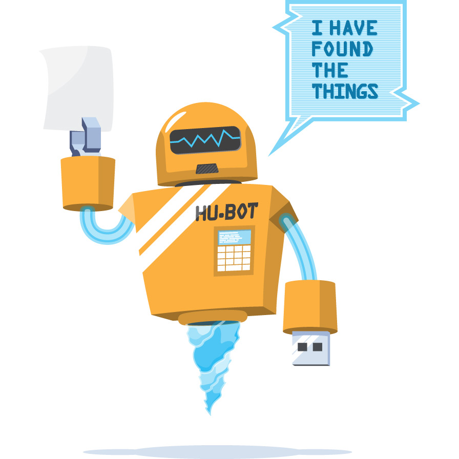
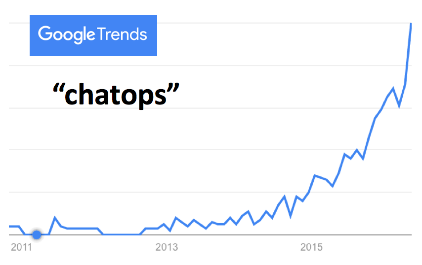
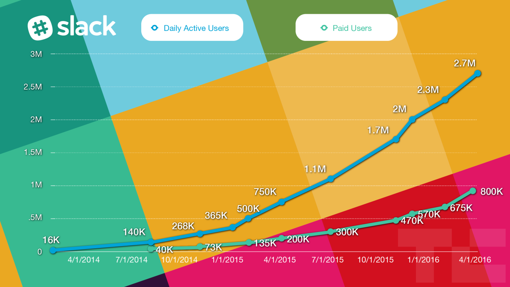
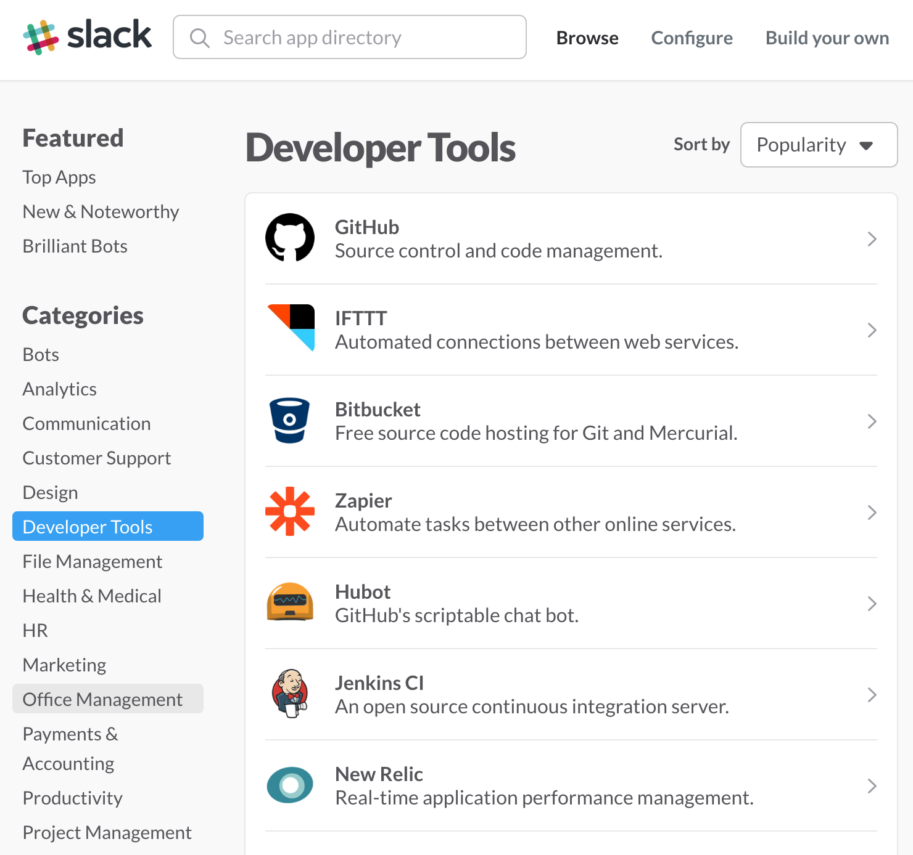
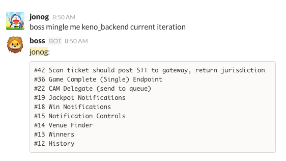
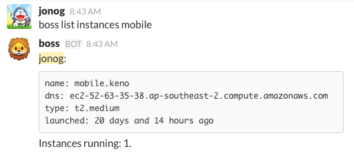
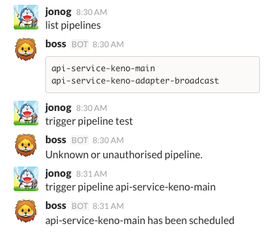
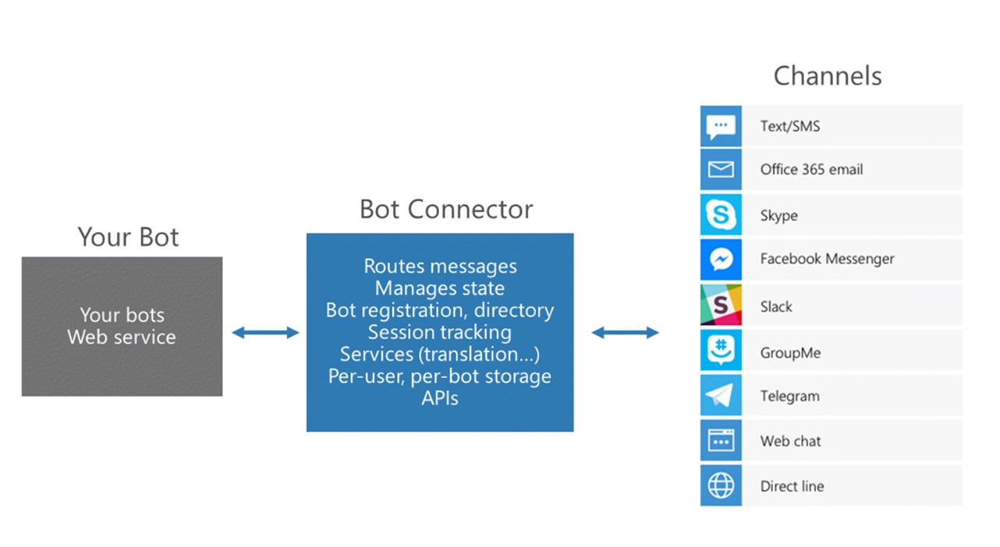

# chatops


^ talk about chat, chatops, team efficiency

---


# ChatOps, ~5 years ago
* Hubot open sourced by Github
* talk to bot -> trigger scripts
* DevOps + Chat = ChatOps

^ the term chatops has been around a while.
typically associated with doing devops-y stuff within the chat platform, like slack or hipchat
an example here: hubot deploy our keno mobile API. hubot says its deployed

```bash


jonog> hubot deploy keno mobile api

...

hubot> deployed keno mobile api to development.keno.

...

jonog> hubot deploy keno web_qld_demo
```

---

# ChatOps Benefits

:factory: encourages automation

:loudspeaker: share scripts amongst team

:zap: accelerates learning

:family: democratise devops

:jack_o_lantern: fun

---

# ChatOps[^1].
```coffeescript
module.exports = (robot) ->

  robot.respond /pug bomb( (\d+))?/i, (msg) ->
    count = msg.match[2] || 5
    msg.http("http://pugme.herokuapp.com/bomb?count=" + count)
      .get() (err, res, body) ->
        msg.send pug for pug in JSON.parse(body).pugs

```

^ Best illustrated with an example
Can anyone guess what this does?

[^1]: Requires demo.

---



---



---
# ChatOps, today
* things previously done by bots + scripting
    * now via integrations
* bots are smarter :space_invader:
* relevance for us -> team efficiency

^ the chat world has changed since 5 years ago
chatops is a lot more than hubot, and a lot more than devops

---

# Chat today: integrations - what & why


- make better use of SaaS tools
- feed in data and notifications

---



# Chat today: integrations - how
* installs via App Directory
* webhooks (in, out)
* slash commands, APIs
* deeper integrations
    * buttons
    * cards
    * widgets

---

# Chat today: bots - script execution
* script execution bots
    * pick language. e.g. Hubot (JS), Lita (ruby)
* experiments with Lita
    * [github.com/TabDigital/chatops](https://github.com/TabDigital/chatops)

---

# Experiments

---



---



---



---

# Chat today: bots - conversation and AI
* conversation & AI toolkits
    * Slack's botkit
    * wit.ai Bot Engine (fb acquisition)
    * Microsoft Bot Builder SDK
* these vs older and simpler bots
    * parse intent, natural language
    * complex state logic
    * learn

---

# Chat today: bots - innovation


* surprising to see microsoft as bot innovator?
* bots becoming mainstream (fb, telegram)
    * will they stick?

---

# Chat today: relevance for us
* technical and non-technical integration ideas?
* maximise use of our productivity tools
* cross team interaction & dependencies
* minimise meetings, maximise async comms
* faster onboarding
* moar fun
