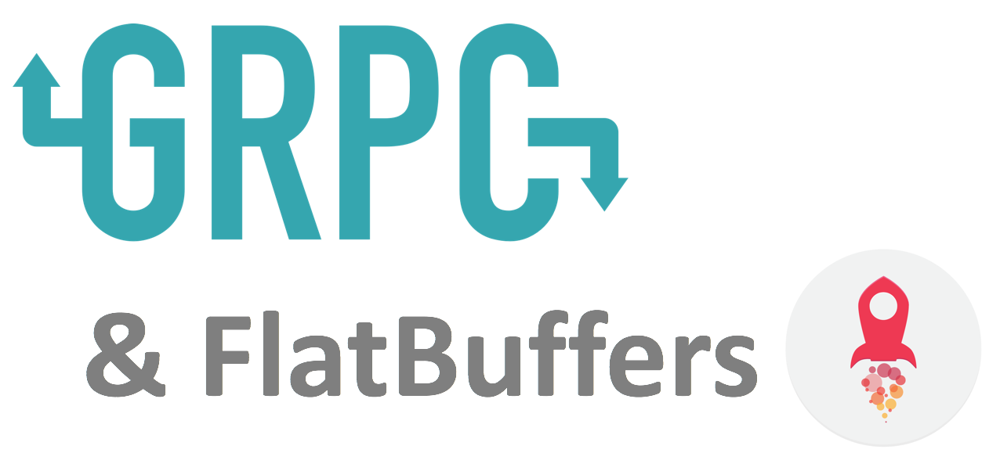
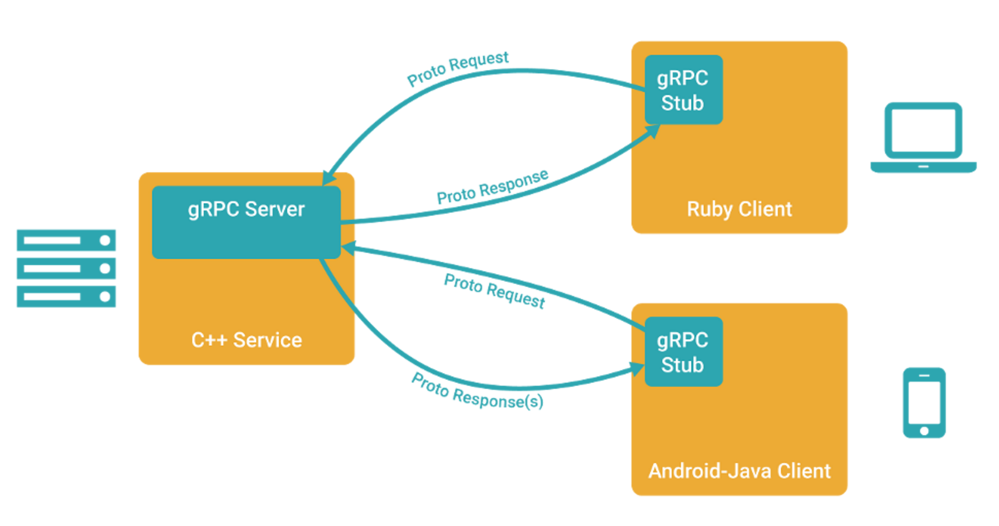

Demo @ Golang Melbourne - September 2017
Jonathan Gomez

---

## 
* Google open sourced in Feb 2015
* **Transport**: `HTTP/2`
* **Wire format**: `Protocol Buffers v3`
* **Service definition**: `Protocol Buffers IDL`
* Libraries in ~10 languages (native C, Go, Java)
* Microservices framework

---

# Step 1: Define IDL
```golang
syntax = "proto3";

package service;

service BookmarksService {
    rpc Add(AddRequest) returns (AddResponse) {}
    rpc LastAdded(LastAddedRequest) returns (LastAddedResponse) {}
}

message AddRequest {
    string URL = 1;
    string title = 2;
}

message AddResponse {}

message LastAddedRequest {}

message LastAddedResponse {
    string ID = 1;
    string URL = 2;
    string title = 3;
}
```
---

# Step 2: Compile

Generate Server Interfaces and Client Stubs



---

## 

FlatBuffers with gRPC

* support since December 2016
* **Wire format**: `FlatBuffers`
* **Service definition**: `FlatBuffers IDL`
* languages: C++, Go (experimental...)

---

## Protocol Buffers vs FlatBuffers?

* **Protocol Buffers**
    * entire buffer must be parsed to read data inside
    * i.e. allocation and deallocation
* **FlatBuffers**
    * allows random access by storing the offsets
    * still allows for forwards/backwards compatibility

---

## Demo & References

**Demo**

* [https://github.com/jonog/grpc-flatbuffers-example](https://github.com/jonog/grpc-flatbuffers-example)

**References**

* [https://github.com/google/flatbuffers/blob/master/grpc/tests/go_test.go](https://github.com/google/flatbuffers/blob/master/grpc/tests/go_test.go)
* [https://github.com/google/flatbuffers/blob/master/tests/go_test.go](https://github.com/google/flatbuffers/blob/master/tests/go_test.go)