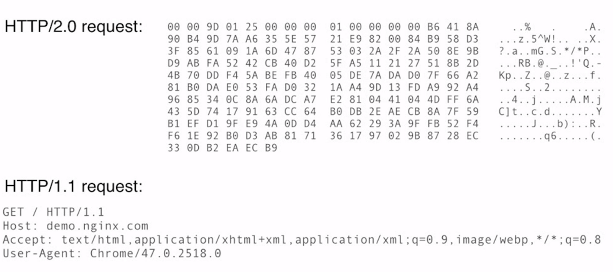
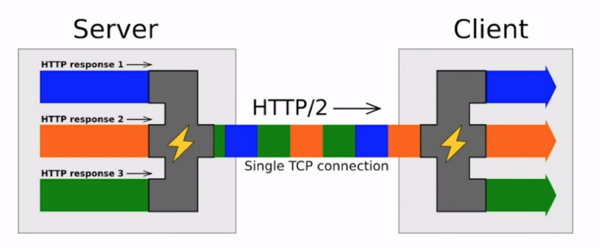
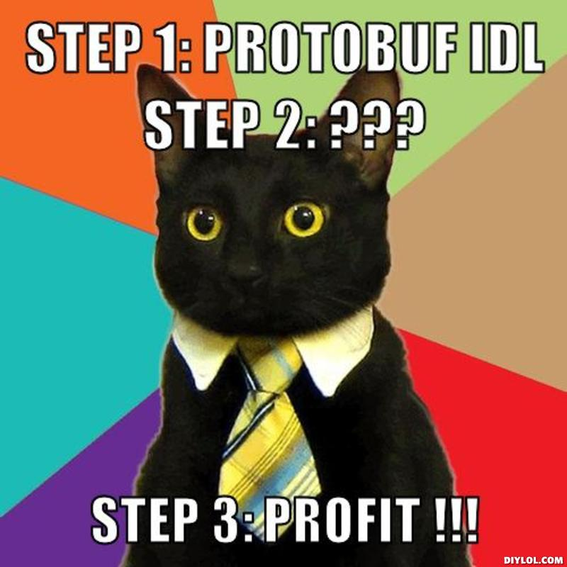
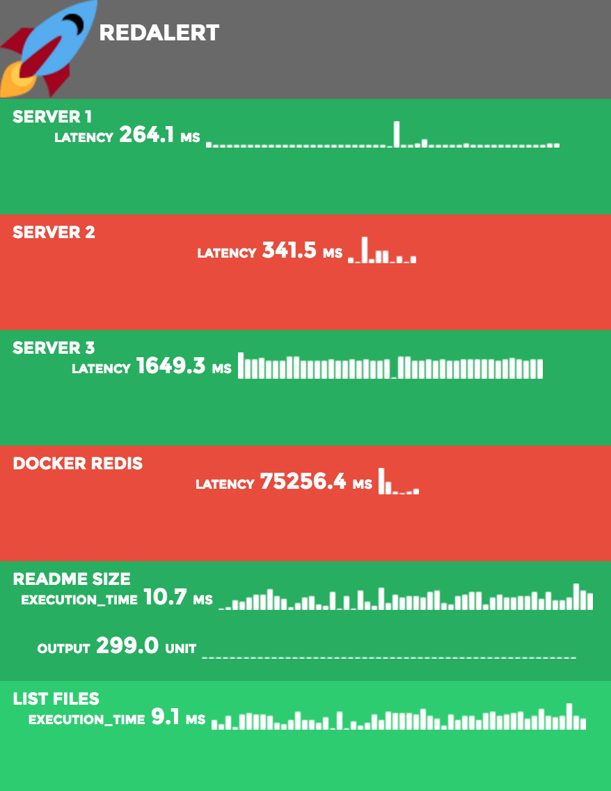
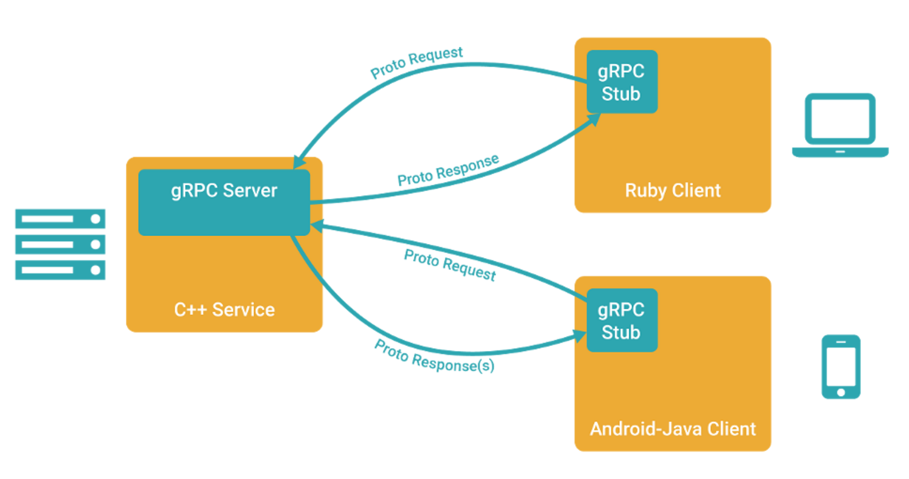
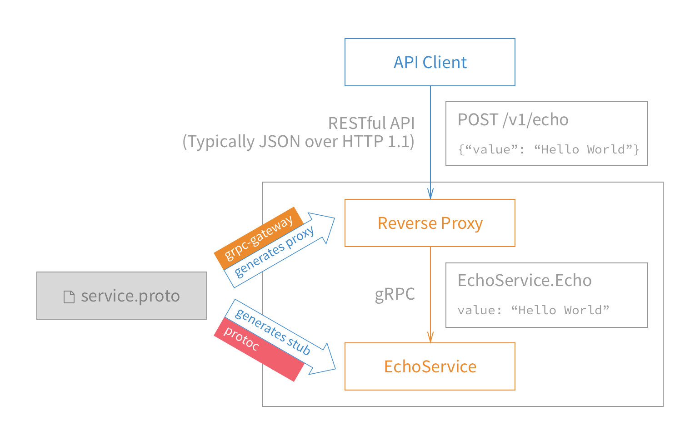

gRPC and Microservices
Jonathan Gomez

Golang Melbourne - June 2016 Go Hack Night

---

## 
* Google open sourced in Feb 2015
* **Transport**: `HTTP/2`
* **Wire format**: `Protocol Buffers v3` (Binary)
* **Service definition**: `Protocol Buffers IDL`
* Libraries in ~10 languages (native C, Go, Java)
* Microservices framework

---

## What is gRPC for? (from official FAQ)
* Low latency, highly scalable, distributed systems
* Developing mobile clients which are communicating to a cloud server
* Designing a new protocol that needs to be accurate, efficient and language independent
* Layered design to enable extension e.g. authentication, load balancing, logging and monitoring etc

---

# The Alternative?
* HTTP-JSON-REST APIs/Microservices
* **Transport**: `HTTP/1.1`
* **Wire format**: `JSON` (Text)
* **Service definition**:
    * `REST`, `Swagger`, `API Blueprint`
    * `JSON Schema`, [strummer](https://github.com/TabDigital/strummer)[^1]

[^1]: Developed for JSON validation and used within node.js services at Tabcorp.

---

# HTTP/2 & Protobuf 101

---

# HTTP/2 - Binary


---

# HTTP/2 - Multiplexed
* multiple reqs/resps can be in-flight over one conn
* avoid multiple TCP conns to make parallel requests



---

# HTTP/2 - Streams
* 'independent, bidirectional sequence of frames exchanged between the client and server within an HTTP/2 connection'
* beyond request/response
* effectively supercedes 'websockets'

---

# Protocol Buffers
* mechanism for serializing structured data
* Interface Definition Language (IDL)
* binary, compact, fast
* versioned

```golang
syntax = "proto3";

message SearchRequest {
  string query = 1;
  int32 page_number = 2;
  int32 result_per_page = 3;
}
```

---

# Protocol Buffers
* strongly typed. `.proto type` -> `Go type`:
    * `float` -> `float32`
    * `bool` -> `bool`
    * `string` -> `string`
* defaults, enums, nested types, `Any`, `OneOf`, maps
* `proto3` easily transformed to JSON (for debugging!)
* [https://developers.google.com/protocol-buffers/](https://developers.google.com/protocol-buffers/)

---

##   Workflow



---

# Example
* pinging tool [**redalert**](https://github.com/jonog/redalert)
* Go binary
* periodically runs checks on various servers/DBs/containers etc
* serves a status web page...
    * lacks an API
    * lacks a CLI
    * lets build one with 



---

# Example - Define Service and Messages
```golang
syntax = "proto3";

package service;

service RedalertService {
    rpc ListChecks(ListChecksRequest) returns (ListChecksResponse) {}
}

message ListChecksRequest {}

message ListChecksResponse {
    repeated Check members = 1;
}

message Check {
    string ID = 1;
    string name = 2;
    enum Status {
        UNKNOWN = 0;
        NORMAL = 1;
        FAILING = 2;
        RECOVERED = 3;
    }
    Status status = 3;
}

```

---

# Example - Generate Server Interfaces and Client Stubs



---

# Example - Generate Server Interfaces and Client Stubs

* Download compiler `protoc` via Github [releases](https://github.com/google/protobuf/releases)
* Install `Go` implementation of gRPC:
* `go get -u google.golang.org/grpc`
* `protoc --go_out=plugins=grpc:. service.proto`

```golang
type RedalertServiceServer interface {
    ListChecks(context.Context, *ListChecksRequest) (*ListChecksResponse, error)
}

```
---

# Example - Implement Server
```golang
type server struct {}

func (s *server) ListChecks(ctx context.Context, in *pb.ListChecksRequest) (*pb.ListChecksResponse, error) {
    ...insert business logic here
}

lis, err := net.Listen("tcp", ":50051")
if err != nil {
	 log.Fatalf("failed to listen: %v", err)
}
s := grpc.NewServer()

pb.RegisterRedalertServiceServer(s, &server{})
s.Serve(lis)

```

---

# Example - Implement Client
```golang
conn, err := grpc.Dial(address, grpc.WithInsecure())
if err != nil {
    log.Fatalf("did not connect: %v", err)
}
defer conn.Close()
c := pb.NewRedalertServiceClient(conn)

r, err := c.ListChecks(context.Background(), &pb.ListChecksRequest{})
if err != nil {
    log.Fatalf("could not get response: %v", err)
}

```

---

# Microservices Framework

* 4 kinds of service methods

```golang
// Request-response
rpc ListChecks(ListChecksRequest) returns (ListChecksResponse) {}

// Server-to-client streaming
rpc StreamEvents(StreamEventsRequest) returns (stream Event) {}

// Client-to-server streaming
rpc SendHeartbeat(stream Heartbeat) returns (HeartbeatResponse) {}

// Bi-directional streaming
rpc NodeChat(stream HealthCheck) returns (stream HealthCheck) {}

```

* Pre-defined error status codes

---

# Backwards Compatibility
* Run a reverse proxy JSON API in front of gRPC server
* Generate via [github.com/gengo/grpc-gateway](http://github.com/gengo/grpc-gateway)



---

# Advanced gRPC
* Context (e.g. propagating timeouts & cancellations)
* Interceptors
* Authentication
* Service discovery / client-side load balancing
* Extend common functionality via protobuf IDL

---

# Key Benefits
* Focus on the service/API design
* Freedom to pick language which suits the problem
* Server-to-server friendly
* Server-to-mobile friendly
* Growing community. Square, CoreOS, Docker.

---

# References
* [http://www.grpc.io/](http://www.grpc.io/)
* [https://developers.google.com/protocol-buffers/](https://developers.google.com/protocol-buffers/)
* [https://github.com/grpc/grpc-go](https://github.com/grpc/grpc-go)
* [gRPC with REST and Open APIs](http://www.grpc.io/posts/coreos)
* [https://www.nginx.com/blog/http2-module-nginx/](https://www.nginx.com/blog/http2-module-nginx/)
